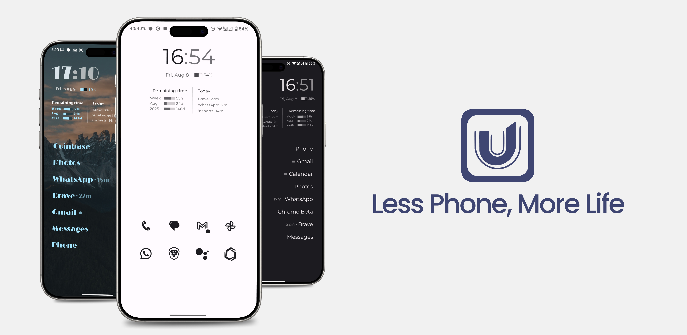

# Unlauncher Releases

This repository contains the release APKs for **Unlauncher** - a minimalist Android launcher designed for digital wellness and intentional phone usage.

## About Unlauncher

**Unlaunch distraction, Launch focus**

Unlauncher is a minimalist Android launcher that helps you focus on what matters by reducing digital distractions. Built with digital wellness in mind, it provides:

- **Minimal Design**: Clean, distraction-free interface with customizable layouts
- **Digital Wellness**: Time progress tracking with week, month, and year indicators
- **Focus-First**: Smart presets to help you choose apps that align with your goals
- **Customizable**: Flexible layouts with text or icon options, themed icons, and orientation choices

## Download Latest Release

### 🚀 [Download from Playstore](https://play.google.com/store/apps/details?id=com.hundredgb.unlauncher)

or

### 🚀 [Download Latest APK](https://github.com/gaurav414u/unlauncher-releases/releases/latest)

## Installation Instructions

1. **Download the APK** from the latest release
2. **Enable Unknown Sources**:
   - Go to Settings → Security → Unknown Sources (Android 7 and below)
   - Or Settings → Apps → Special Access → Install Unknown Apps (Android 8+)
3. **Install the APK** by tapping on the downloaded file
4. **Set as Default Launcher**:
   - When prompted, choose "Unlauncher" as your default home app
   - Or go to Settings → Apps → Default Apps → Home App → Unlauncher

## System Requirements

- **Android Version**: 11.0 (API level 30) or higher
- **Architecture**: ARM64, ARM, x86, x86_64
- **Storage**: ~15MB for installation

## Getting Started

After installation, Unlauncher will guide you through a simple onboarding process:

1. **Choose Your Focus**: Select from smart presets or customize manually
2. **Design Your Layout**: Choose between text or icons, set orientation
3. **Master Gestures**: Learn to long-press for customization and swipe up for app drawer
4. **Set as Default**: Make Unlauncher your permanent home screen

## Features Overview

### Smart Presets
- **Productivity**: Optimized for work and productivity apps
- **Gaming**: Focused on gaming and entertainment
- **Content**: Perfect for content consumption
- **Social**: Streamlined for social media usage
- **I'm Feeling Lucky**: Random app selection
- **Customize Manually**: Full control over app selection

### Customization Options
- **Style**: Choose between text labels or app icons
- **Themed Icons**: Monochrome, theme-colored icons
- **Icon Shapes**: Square, Circle, Squircle options
- **Orientation**: Vertical or horizontal layouts

### Digital Wellness
- Time progress indicators (week, month, year)
- Distraction-free interface
- Intentional app usage tracking

## Support & Feedback

- **Website**: [https://unlauncher.hundredgb.com/](https://unlauncher.hundredgb.com)
- **Issues**: Report bugs or request features via [GitHub Issues](https://github.com/gaurav414u/unlauncher/issues)
- **Feedback**: Share your experience through our [feedback form](https://unlauncher.hundredgb.com/feedback)
- **Community**: Join discussions in our [community section](https://unlauncher.hundredgb.com/community)

## Privacy & Security

Unlauncher is designed with privacy in mind:
- No data collection or tracking
- All data stays on your device
- Read our [Privacy Policy](https://unlauncher.hundredgb.com/privacy)

**Made with ❤️ for digital wellness and intentional living**

*Unlaunch distraction, Launch focus*
